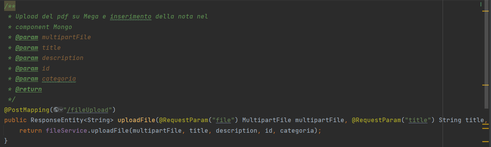

# Back-end

## Pattern MVC (Model-View-Controller)

**L'MVC è un pattern** utilizzato per suddividere e organizzare il codice del programma in parti ben distinte. In particolare:

* **Model:** contiene i metodi e gli oggetti per l'accesso ai dati.
* **View:** il suo compito è quello di visualizzare i dati all'utente e ne gestisce l'interazione tra UI e backend.
* **Controller**: si occupa di gestire le richieste da parte della view e inviare le corrispondenti risposte in relazione ai dati ricevuti ed ai dati del model.

#### Architettura 3-tier

Nel caso specifico si è scelto di dividere la parte di view da quella di model e controller. È una scelta che offre una grande flessibilità, in quanto permette di separare la logica e le chiamate al database, dalla logica di visualizzazione.

Questa struttura oltre a fornire una maggiore organizzazione, risolve il problema di creare una applicazione monolitica.

Le tre principali parti che compongono questa architettura sono:

* **Front-End**: Realizzazione di una Single Page Application. Gestisce esclusivamente la parte di visualizzazione, inoltra le richieste dei dati al backend, riceve le risposte e mostra correttamente i dati.
* **Back-End**: Ha il compito di gestire l'autenticazione degli utenti, gestire le richieste in arrivo da parte del frontend, e di instradare le query verso il database. Inoltre gestisce la logica della piattaforma.
* **Database**: Il database non relazionale si occupa di mantenere tutti i dati che servono all'applicazione per funzionare. Verrà consultato esclusivamente dal backend.

### Spring Boot

Spring Boot è una soluzione per il framework Spring di Java, che è stato rilasciato nel 2012 e **riduce la complessità di configurazione di nuovi progetti Spring**. A questo scopo, Spring Boot definisce una configurazione di base che include le linee guida per l'uso del framework e tutte le librerie di terze parti rilevanti, rendendo quindi l'avvio di nuovi progetti il più semplice possibile.

### Angular

Angular è un framework JavaScript per creare interfacce utente. In particolare viene utilizzato per realizzare la parte del Frontend, ovvero la "V" del pattern MVC. Si occupa di gestire tutte le interazioni con l'utente, e visualizzare i dati corretti che provengono dal backend.

### MongoDb

MongoDB **** è **** un DBMS non relazionale, orientato ai documenti. Classificato come un database di tipo NoSQL, MongoDB si allontana dalla struttura tradizionale basata su tabelle dei database relazionali in favore di documenti in stile JSON con schema dinamico, rendendo l'integrazione di dati di alcuni tipi di applicazioni più facile e veloce.\

### La struttura logica

I packages principali sono:

* I controller: si occupano di fornire l'endpoint, di chiamare il service di riferimento e restituire il risultato
* I model: sono le classi su cui sono strutturati i diversi oggetti
* I services: eseguono i metodi e passano la risposta ai controller

.png>)

### L'inserimento di un file

L'inserimento di un file nella piattaforma è affidato al **File controller** che prende come parametri il file, il titolo, la descrizione, l'id dello user, la categoria e li passa al metodo nel file service.

**Il file service** chiama il metodo di upload sul cloud e restituisce "Success" se l'upload è andato a buon fine.

.png>)

**Il metodo uploadFile** utilizza la libreria Unirest, effettua una post di inserimento su Mega e contemporaneamente del record sul database Mongo.&#x20;

.png>)

## Il testing

La parte di testing è volta a certificare che tutte le funzioni e le api funzionino e la conseguente reazione al fallimento. Infatti con l'utilizzo della **libreria JUnit** è possibile simulare delle chiamate Mock, testando sia l'inserimento di parametri giusti e aspettati con conseguente risposta di successo e sia con input errati e inattesi, verificando in questo caso la restituzione di eccezioni.&#x20;

.png>)

### Un esempio di test

Questa è la classe incaricata di testare la funzione di login di un utente

#### Chiamata corretta:

1. Si effettua il test di una chiamata corretta alla Api di autenticazione
2. Si inseriscono i parametri di email e password corretti
3. Si verifica che la risposta restituisca 200OK&#x20;

#### Chiamata errata:

1. Si effettua il test di una chiamata errata alla Api di autenticazione
2. Si inseriscono i parametri di email e password errati
3. Si verifica che la risposta restituisca 403 Forbidden

.png>)

