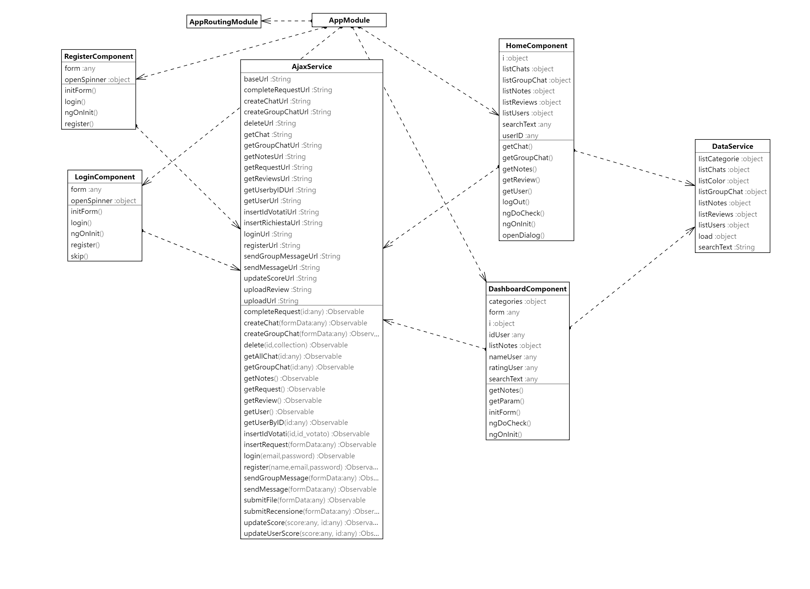
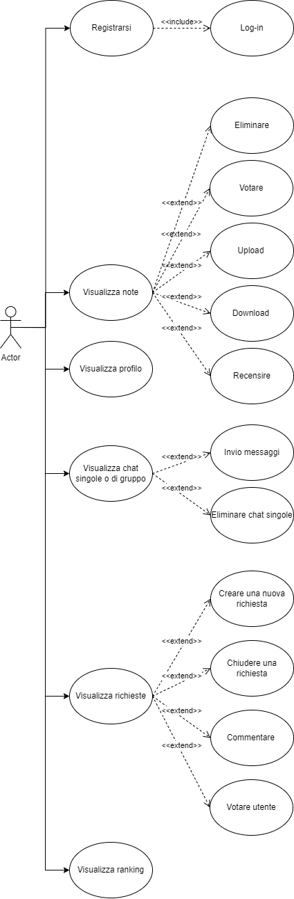
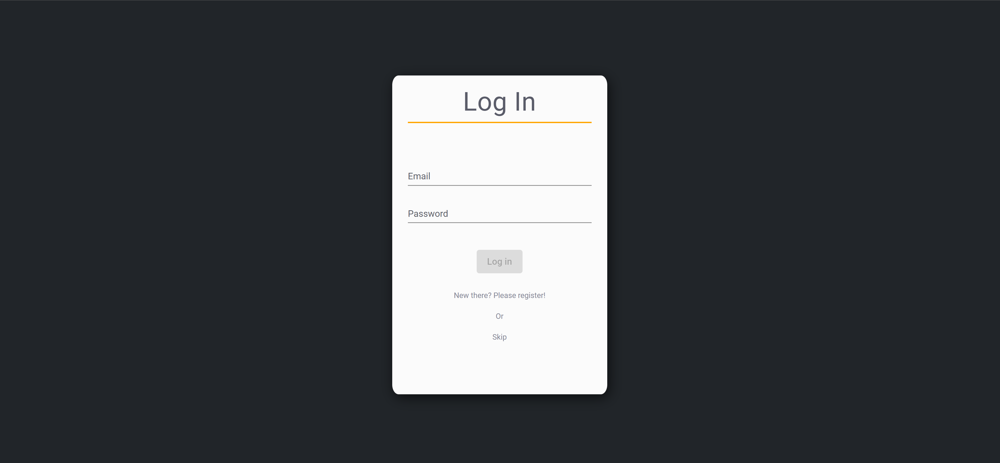
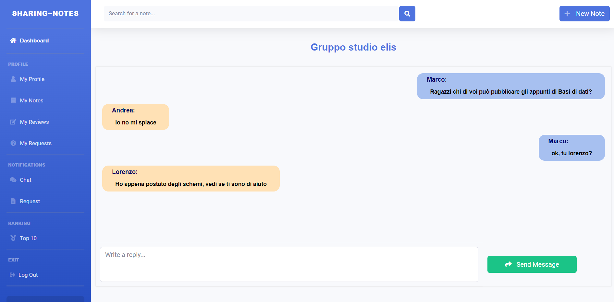
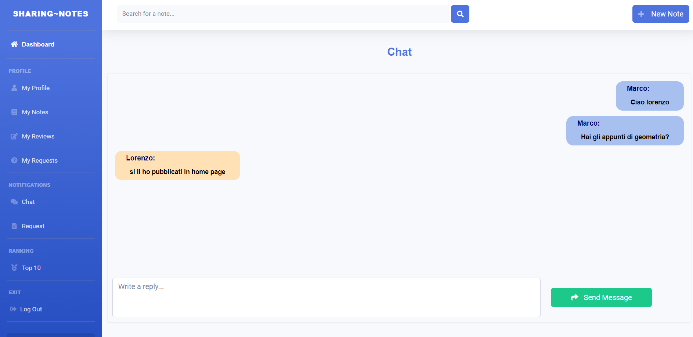
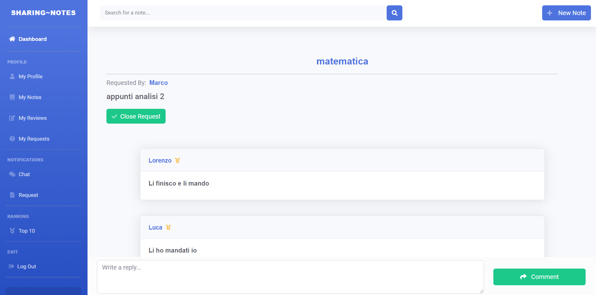

# Front-end

### Introduzione ad Angular

La tecnologia utilizzata per il front-end è Angular, un framework open source per lo sviluppo di applicazioni web sviluppato principalmente da Google. Il linguaggio di programmazione usato per Angular è TypeScript.

Le applicazioni sviluppate in Angular vengono eseguite interamente dal web browser dopo essere state scaricate dal web server (elaborazione lato client).

### Struttura del progetto

In Angular il progetto è diviso in component, ognuno ha all’interno il proprio codice e tra di loro sono collegati attraverso il routin. In una stessa pagina possono coesistere più component.

La struttura implementata nel progetto è la seguente:

*   app

    * chat
    * chat-group
    * dashboard
    * home
    * login
    * messages
    * new-chat
    * new-group-chat
    * new-note
    * new-review
    * new-richiesta
    * new-score
    * new-user-score
    * note
    * profile
    * profile-note
    * profile-request
    * profile-review
    * ranking
    * register
    * request
    * review
    * richiesta

    // Struttura interna dei component

    * name.component.html
    * name.component.scss
    * name.component.spec.ts
    * name.component.ts
* assets
  * file ...
* environments
  * file ...
* ajax.service.ts
* data.service.ts
* app-routing.module.ts
* app.component.ts
* index.html
* app.modules.ts
* file ...

Ogni _**component**_ ha la stessa struttura, in esso troviamo quattro file di script, gli script saranno uno del codice HTML, uno del CSS e due in Typescript.

Nell’_**ajax.service**_ saranno presenti tutte le chiamate alle funzioni del back-end, questo component quindi serve per collegare gli script java in modo da poterli richiamare nel front-end

Il _**data.service**_ sono presenti tutte quelle variabili che vengono richiamate e utilizzate in più component

L’_**app.routing**_ contiene tutti i percorsi di routing che ci permenttono di connettere i component grazie ai vari path, essa viene richiamata nell’_**app.component**_ e nell’_**index.html**_

Tutti i component vengono dichiarati e importati nell’_**app.module**_ e questo ci permette di richiamarli nel codice

Altre cartelle e file non citati contengono script di configurazione che vengono creati automaticamente con la creazione del progetto

### Class Diagram di progetto

Tutte le connessioni precendetemente espresse vengono ben rappresentate nel Class Diagram, all’interno sono inclusi soltanto i component delle schermate principali e come sono collegati ai service e all’appModule, il quale consente di utilizzare il routing



### Le schermate

Lo use case realizzato in figura permette di visualizzare tutte le funzionalità a cui può accedere l’utente visualizzando il sito



#### Login e registrazione

La pagina che si mostra all'apertura del sito è proprio quella dedicata **all'accesso o alla registrazione** di un utente alla piattaforma. Inoltre c'è la possibilità di fare uno **skip dell'accesso** per chi volesse solamente visionare e scaricare del materiale.

  (1).png>)

#### La Dashboard

La pagina Home è la prima che viene mostrata, sulla sinistra abbiamo una **sidebar** che funge da menù per le diverse pagine dell'applicazione, in alto la **navbar** in cui è possibile ricercare un documento o inserirne uno nuovo mentre nella **parte centrale** l'elenco delle note presenti in piattaforma.

.png>)

#### Inserimento di una nota

L'inserimento di un documento nella piattaforma avviene tramite una form in cui si richiedono dei campi come: la materia, la descrizione, la categoria e il file stesso.

.png>)

#### La pagina dedicata alla nota

Cliccando la singola nota è possibile visualizzare una descrizione aggiuntiva, l'autore e lo score della nota, inoltre si può scaricare il file, aggiungere una recensione e uno score.

.png>)

#### Il profilo utente

La pagina del profilo utente mostra lo score dell'utente insieme alle ultime 3 note pubblicate, le ultime 3 recensioni e le ultime 3 richieste. Cliccando sul riquadro si aprirà la pagina dedicata alla nota, recensione o richiesta.

.png>)

Se clicchiamo su “My Notes” visualizzeremo una pagina in cui saranno presenti tutte le note che abbiamo pubblicato e dal titolo potremo anche sapere quante sono in totale

 (1).png>)

Se clicchiamo su “My Reviews” visualizzeremo una pagina in cui saranno presenti tutte le recensioni che abbiamo pubblicato, cliccando sul riquadro verremo riportati alla nota che abbiamo recensito

.png>)

Se clicchiamo su “My Requests” visualizzeremo una pagina in cui saranno presenti tutte le richieste che abbiamo pubblicato differenziate se ancora attive o meno, cliccando sul riquadro verremo riportati alla richiesta

.png>)

#### La chat

In questa sezione sono mostrate tutte le chat singole con i diversi utenti e le chat di gruppo in cui si è iscritti. E’ possibile sia creare una nuova chat, singola o di gruppo, ed eliminare una di quelle singole

.png>)

Esempio chat di gruppo



Esempio chat singola



#### Le richieste

Ogni utente in questa sezione ha la possibilità di richiedere un determinato appunto o di vedere quali file sono stati richiesti dagli altri utenti e cliccando sul riquadro si aprirà la pagina dedicata alla richiesta

.png>)

Ogni richiesta prevede la possibilità di scrivere un commento (pubblico), di votare gli user che si sono distinti in negativo o in positivo e, se si è l’autore della richiesta, è possibile decidere di chiuderla e non rendendola più pubblica



#### La classifica

Ogni utente può votare ed essere votato dagli altri, cosi come gli appunti, dando il via a classifiche di migliori utenti e di documenti più utili, i criteri delle classifiche sono la media dei voti e il numero di voti.

.png>)

***

### Il routing

Lo spostamento da una schermata ad un’altra avviene tramilte il routing, il quale viene definito nell’app routing module.

```tsx
const routes: Routes = [
  { path: "", component: LoginComponent },
  { path: "register", component: RegisterComponent },
  {
    path: "home", component: HomeComponent, children: [
      { path: "", component: DashboardComponent },
      { path: "cat/:category", component: DashboardComponent },
      { path: "messages", component: MessagesComponent },
      { path: "profile/notes", component: ProfileNoteComponent },
      { path: "profile/reviews", component: ProfileReviewComponent },
      { path: "profile/request", component: ProfileRequestComponent },
      { path: 'profile/:_id', component: ProfileComponent },
      { path: 'note/:_id', component: NoteComponent },
      { path: 'chat/:_id', component: ChatComponent },
      { path: 'review/:_id', component: ReviewComponent },
      { path: 'chat-group/:_id', component: ChatGroupComponent },
      { path: 'request', component: RequestComponent},
      { path: 'ranking', component: RankingComponent},
      { path: 'richiesta/:_id', component: RichiestaComponent}],
  },
  { path: '**', component: LoginComponent }];

@NgModule({
  imports: [RouterModule.forRoot(routes)],
  exports: [RouterModule]
})
export class AppRoutingModule { }
```

Tutti i moduli inizialmente vengono importati e successivamente viene definito il path (l’URL) per cui si deve aprire quel component, nel momento in cui viene utilizzata la sintassi “:\_id” si intende quella parte di path come una variabile, ovvero ciò che sarà scritto in quella parte sarà ,in questo caso, l’id.

L’utilizzo di questo tipo di path ci consente di personalizzare i component potendo prendere l’id direttamente dall’URL.

Esempio di oggetto con con un routerLink, questo significa che quando cliccheremo in quel punto verremo riportari all’ HomeComponent che avrà nell’URL segnata quella categoria (che verrà utilizzata per filtrare le note)

```tsx
<mat-option *ngFor="let cat of categories" [value]="cat" [routerLink]="['/home/cat',cat]">
{{cat}}
</mat-option>
```

### Comunicazione con il Backend

La comunicazione con il backend avviene attraverso ajax.service, questo service contiene al proprio interno tutti i metodi per ogni tipo di chiamata.

Le chiamate vengono svolte dai metodi http.get e http.post. I metodi prendono come parametro l’URL del backend, il quale è composto dalla variabile “baseUrl” e dall’endpoint del backend.

In questo caso possiamo osservare come vengono passati i parametri nell’http.post

```tsx
export class AjaxService {

  constructor(private httpClient: HttpClient) { }

  baseUrl = "<http://localhost:8080/>";
  loginUrl = this.baseUrl + "login/authenticate";
  registerUrl = this.baseUrl + "register/register";
  //... altri url

  login(email: string, password: string) {
    const data = { "email": email, "password": password };
    return this.httpClient.post(this.loginUrl, {}, { params: data });
  }

	//... altri metodi
}
```
